# 忍びロック 現状アプリ説明書

2026年9月12日 / バージョン 0.1.0・ビルド8 / ソース d969d8b

忍びロックは、指定した曜日と時間帯に、選んだiPhoneアプリをロックするアプリです。必要なときは利用者がリワード広告の視聴を選び、対象の1アプリだけを5分間使えます。

## この資料の読み方

現在の機能、画面、操作の流れをまとめた、デザイン検討用の説明書です。画面の色や形は現状の記録です。新しいデザインで維持する必要があるのは、機能の意味と状態の違いです。

スクリーンショットはiPhone 17 Pro・iOS 26.5のシミュレータで、現行のSwiftUI画面を表示して撮影しています。撮影専用のコピーで、許可状態、ルール、広告の結果をサンプルとして与えています。「動画アプリ」「SNSアプリ」「ゲームアプリ」とアイコンは代替表示です。実際にはiOSが対象アプリの名前とアイコンを表示します。ロックや広告配信の実機動作を証明する画像ではありません。

アプリ選択画面、スクリーンタイムの許可ダイアログ、対象アプリ上のロック画面、広告そのものは、現行版の撮影画像を収録していません。表示内容と操作をソースに基づいて説明しています。過去の試作画面は収録していません。

## 1. アプリの目的と機能

主な利用場面は、仕事・勉強・就寝前など、つい開いてしまうアプリから距離を置きたい時間です。アカウント登録は不要です。

| 機能 | 現在の挙動 |
| --- | --- |
| 週間ルール | 名前、曜日、開始・終了時刻、対象アプリ、有効・休止を設定する |
| 自動ロック | 有効なルールの時間内に対象アプリをロックする |
| 重なったルール | 対象アプリを合算し、同じアプリは重複して数えない |
| 一時解除 | 広告の報酬通知を受け取ったら、そのアプリだけ5分間解除する |
| 残り時間 | 解除完了画面とホームでカウントダウンを表示する |
| 再ロック | 5分後もルールの時間内なら再ロックする。時間外なら通常利用に戻る |
| ルール管理 | 作成、編集、削除、個別休止、全ルールの一括休止 |
| データ | ルールとアプリの選択情報を端末内に保存する |

利用回数・起動回数の統計画面、実績、ランキング、アカウント、課金画面、タブバーは現行の画面構成にありません。

## 2. 操作の流れ

### はじめて使う

1. ホームの「スクリーンタイムを許可する」を押す。
2. iOSの許可画面で利用を許可する。
3. 「ルールをつくる」を押す。
4. 名前、曜日、時間を入力し、対象アプリを選ぶ。
5. 「保存」を押す。指定した時間になるとロックが適用される。

### ロック中に少し使う

1. ロック対象のアプリを開くと、iOSのロック画面が出る。
2. 「広告を見て5分使う」を押すと忍びロックが開き、対象アプリを引き継ぐ。
3. 忍びロック内の説明画面で、もう一度「広告を見て5分使う」を押す。
4. 全画面広告を見る。報酬が確定すると5分解除が始まる。
5. 広告を閉じると完了画面に残り時間が表示される。
6. iPhoneのホーム画面やアプリ切り替えから対象アプリへ戻る。
7. 5分後もロック時間中なら、自動で再ロックされる。

ロック画面のボタンは広告を直接再生せず、忍びロック本体への移動を行います。また、完了画面の「ホームに戻る」は忍びロックのホームへ戻る操作です。対象アプリを直接起動するボタンではありません。

## 3. 画面一覧

| ID | 画面・状態 | 開き方 | 主な役割 |
| --- | --- | --- | --- |
| S01 | 初回ホーム・許可前 | 初回起動、許可の取り消し後 | 利用許可の案内 |
| S02 | ホーム・ルールなし | 許可後、ルールが0件 | 最初のルール作成へ誘導 |
| S03 | ホーム・ルールあり | 通常起動 | ロック状況とルールを確認・操作 |
| S04 | ルール作成 | ホームの「ルールをつくる」 | 週間ルールの入力 |
| S05 | ルール編集 | 各ルールの「編集」 | 内容の変更、選択アプリ確認、削除 |
| S06 | アプリ選択 | 作成・編集の「アプリを選ぶ」 | iOS標準の選択画面 |
| S07 | 対象アプリのロック画面 | ロック中のアプリを開く | 閉じるか、一時解除へ進むかを選ぶ |
| S08 | 5分解除の説明 | ロック画面から移動 | 対象と広告視聴の条件を確認 |
| S09 | 解除完了 | 広告の報酬を受け取る | 利用可能になったことと残り時間を表示 |
| S10 | ホーム・一時解除中 | 解除後にホームへ戻る | 対象アプリと残り時間を確認 |
| S11 | 設定 | ホーム右上の歯車 | 許可状態、プライバシー、一括休止 |
| S12 | 確認・エラー | 保存失敗、削除、一括休止など | 理由や操作の影響を伝える |

## 4. 初回ホームとルールなし

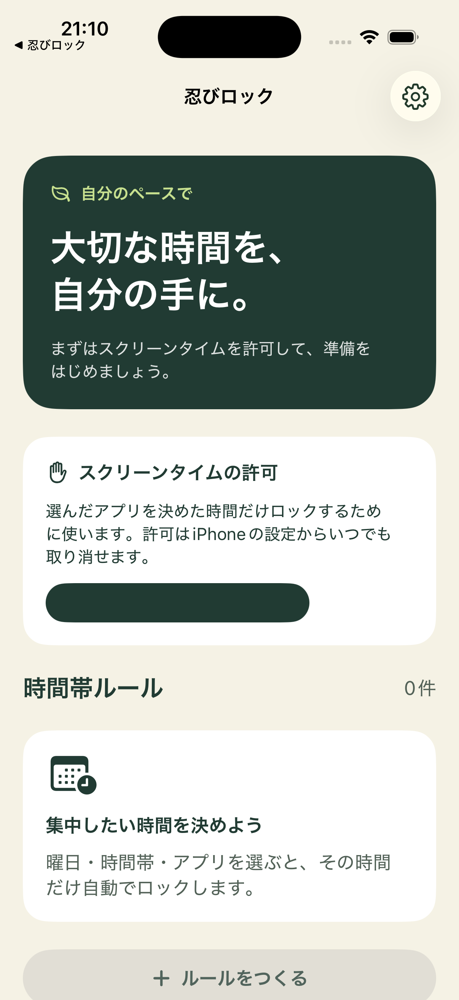

上部には「忍びロック」のタイトルと設定ボタンがあります。大きな濃緑のカードに「大切な時間を、自分の手に。」を表示し、その下に許可を求めるカードを置いています。

許可カードは、選んだアプリを指定時間だけロックする目的と、iPhoneの設定から許可を取り消せることを説明します。許可されるまでは「ルールをつくる」を押せません。許可に失敗した場合は、スクリーンタイムの設定を確認する案内が表示されます。

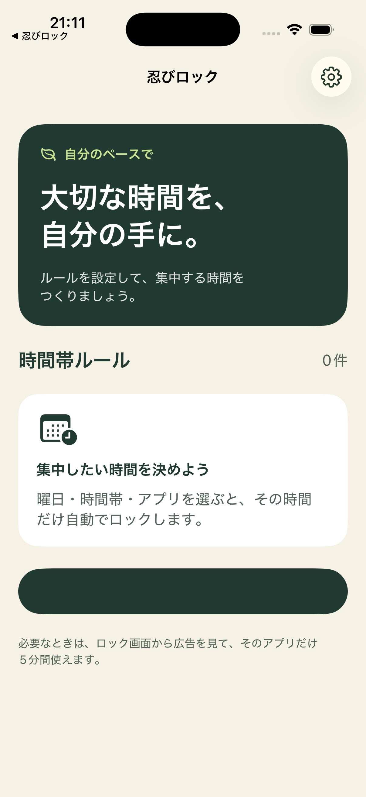

許可後は許可カードが消えます。ルールが0件のときは「集中したい時間を決めよう」と曜日・時間帯・アプリの説明を表示します。

## 5. ホームとルール一覧

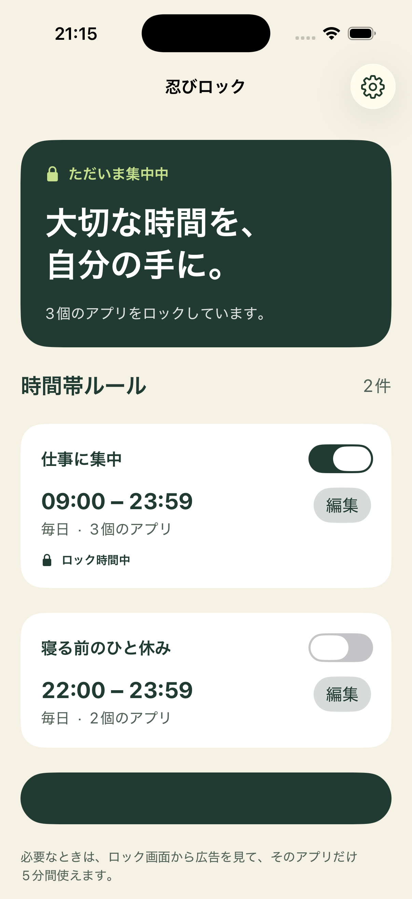

ホームは縦スクロールです。下部固定のナビゲーションはありません。上から、状況を伝えるカード、必要に応じた一時解除・解除対象カード、時間帯ルール一覧、作成ボタン、5分解除の説明が並びます。

状況カードは、実際にロックしているアプリがあれば「ただいま集中中」と件数を表示します。ロックがなければ「自分のペースで」と表示し、有効なルールがあれば次の切り替え日時を示します。

ルールカードには次を表示します。

- ルール名と有効・休止のスイッチ。
- 開始時刻と終了時刻。
- 曜日と対象アプリ数。
- 「編集」ボタン。
- 有効なルールの時間内かつ許可済みなら「ロック時間中」。

スイッチの変更はその場で保存します。休止したルールは一覧に残ります。他のルールも同じアプリをロックしている場合、1つのルールを休止しても、そのアプリのロックは続きます。

「ロック時間中」はルールの状態です。一時解除中のアプリがあっても、ルールの時間内なら表示されます。全アプリの実際のロック件数とは意味が異なります。

## 6. ルールの作成・編集

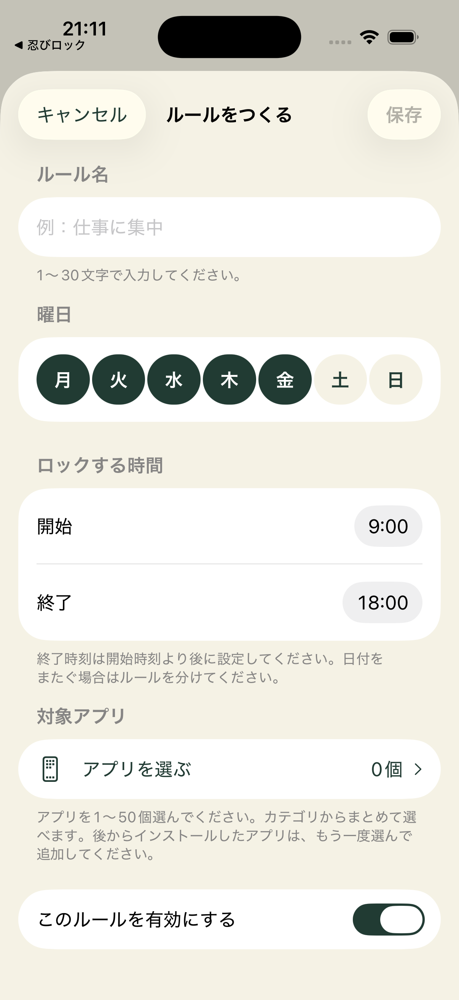

作成画面はホームの上にシートで開きます。上部左が「キャンセル」、右が「保存」です。キャンセルでは変更を保存しません。

| 項目 | 初期値 | 入力条件・操作 |
| --- | --- | --- |
| ルール名 | 空欄 | 前後の空白を除いて1〜30文字 |
| 曜日 | 月〜金 | 月〜日の7つのボタン。1つ以上選択 |
| 開始 | 09:00 | 時・分を選ぶiOS標準の時刻入力 |
| 終了 | 18:00 | 開始より後。同じ時刻、日付をまたぐ指定は不可 |
| 対象アプリ | 0個 | 1〜50個を選択 |
| 有効 | オン | 保存時に有効にするかを選ぶ |

日付をまたぐ設定はルールを分ける案内があります。現行の時刻選択範囲は00:00〜23:59で、24:00の入力はありません。

アプリが未選択の場合や、アプリ数の制約に違反する場合は保存ボタンが無効です。名前・曜日・時刻の不備は、保存を試みた際のエラーで知らせます。

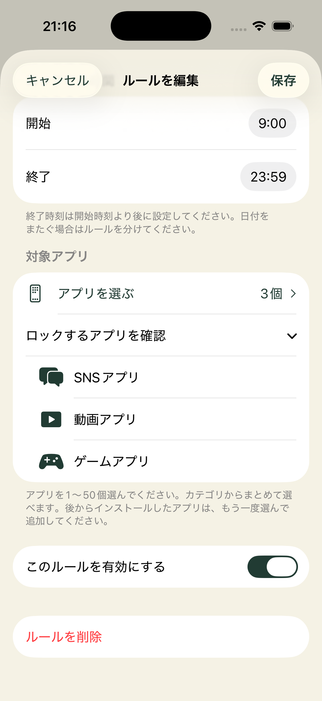

編集画面では保存済みの値を表示します。「ロックするアプリを確認」を開くと、選んだアプリの名前とアイコンが縦に並びます。最下部に「ルールを削除」が追加されます。

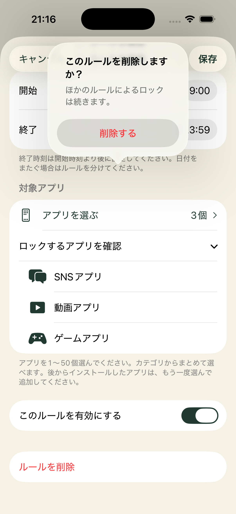

削除は確認ダイアログを挟みます。「このルールを削除しますか？」に対し、「削除する」を選ぶと一覧から消えます。「ほかのルールによるロックは続きます。」と表示します。

## 7. アプリ選択とロック画面

### S06 アプリ選択

現行画像は未収録です。iOSのFamilyActivityPickerを開きます。カテゴリからアプリをまとめて選択でき、アプリを個別に選ぶこともできます。

画面の上部説明は「ロックするアプリを選んでください。カテゴリを選ぶと、中のアプリをまとめて選べます。」です。下部にはWebサイトが対象外であることと、1〜50個の制限を示します。

保存するのは選択時点の個別アプリです。カテゴリ全体を将来にわたってロックする設定ではありません。後からインストールしたアプリは、編集画面で選び直して追加します。Webサイトを選んだ場合は、選んだアプリだけを保存する説明を表示します。

選択画面を閉じてもアプリが0個なら、編集画面内に「アプリが選択されていません。カテゴリを開いて、アプリを1つ以上選んでください。」と表示します。

1ルール50個に加え、同じ曜日・時間に有効な複数ルールを合算した対象アプリも50個までです。超えた場合は、対象を減らすか曜日・時間をずらす案内を表示します。

### S07 対象アプリのロック画面

現行画像は未収録です。ロック対象アプリを開いたときに、iOSのShieldが表示します。忍びロック本体内のページではありません。

| 要素 | 現在の指定 |
| --- | --- |
| 背景 | 薄いベージュとシステムのぼかし |
| アイコン | 盾と鍵のシステムアイコン |
| タイトル | 忍びロック |
| 説明 | 「対象アプリ名はロックされています。」「大切な時間を、守ろう。」 |
| 主ボタン | 閉じる |
| 第2ボタン | 広告を見て5分使う |

「閉じる」は対象アプリを閉じます。「広告を見て5分使う」は対象アプリを記録して忍びロック本体を開きます。画面構造と配置はiOSのShieldが管理し、アプリ側は指定可能な文言・色・アイコンを設定しています。

## 8. 5分解除の説明と広告

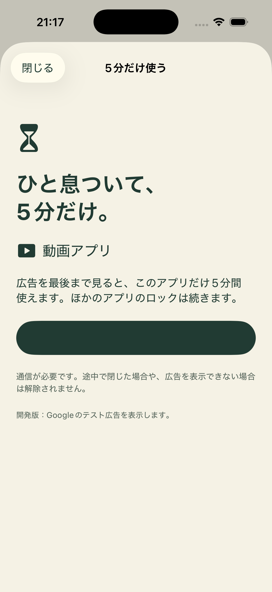

本体が解除対象を受け取ると「5分だけ使う」シートを表示します。画面には砂時計のアイコン、「ひと息ついて、5分だけ。」、対象アプリ、解除の条件を置いています。

「広告を見て5分使う」を押した時点で広告の準備を始めます。通信が必要です。準備中はスピナーと「広告を準備しています」を表示し、ボタンを押せなくします。

広告はGoogleの広告SDKが全画面で表示します。現在は公式テスト広告を使用し、本体の画面下部にも開発版であることを表示しています。広告クリエイティブや広告内の閉じるボタンは、本体のデザイン対象とは分けて扱います。

解除は広告SDKの報酬通知を受け取ったときに始まります。途中で閉じた場合や、広告を表示できなかった場合は解除しません。広告の表示中は本体シートを閉じられません。

| 状態 | 表示・挙動 |
| --- | --- |
| 準備前 | 条件と対象アプリを表示し、広告視聴ボタンを有効にする |
| 準備中 | 「広告を準備しています」とスピナー。連続タップ不可 |
| 途中終了 | 「広告の視聴が完了していないため、ロックを続けています。」 |
| 表示失敗 | 「広告を表示できませんでした。時間をおいて再度お試しください。」 |
| 他の一時解除が継続中 | 「一時解除が終わってから、もう一度お試しください。」。視聴ボタン無効 |
| ロック時間が終了 | 「このアプリのロック時間は終了しました。」。視聴ボタン無効 |

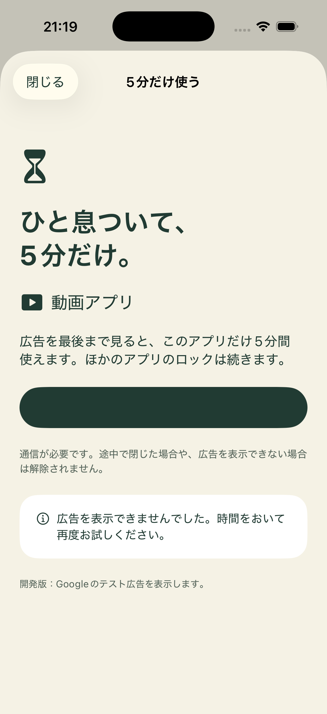

## 9. 解除完了と残り時間

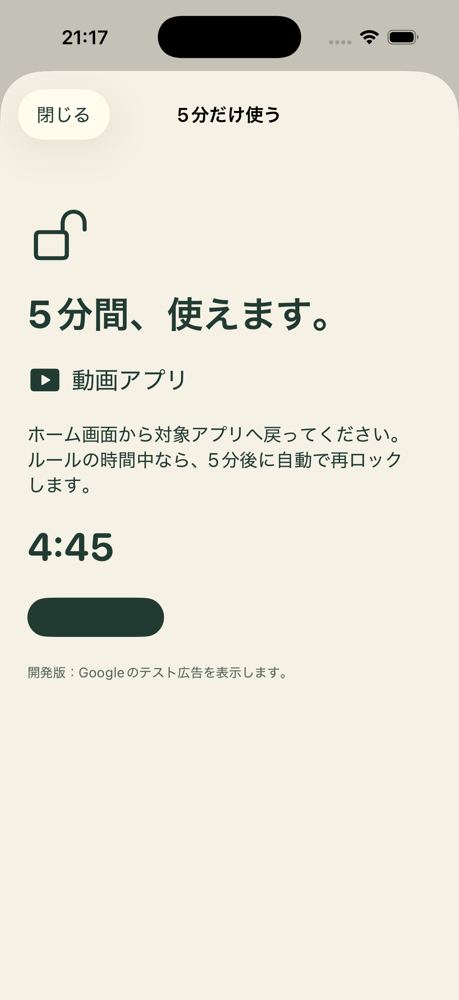

報酬が確定すると見出しが「5分間、使えます。」に変わり、開いた鍵のアイコンと残り時間を表示します。対象アプリへの戻り方と、ルールの時間中なら5分後に再ロックすることを説明します。

カウントダウンは報酬確定から進むため、この画面が見えた時点で5:00を下回る場合があります。「ホームに戻る」で忍びロックのホームへ戻ります。

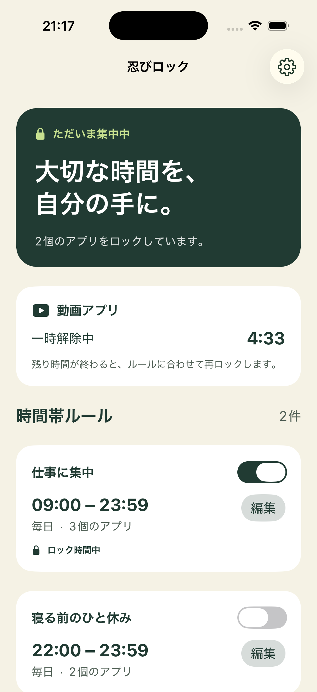

ホームにも対象アプリ名、「一時解除中」、残り時間、再ロックの説明を表示します。他のアプリのロックは続きます。一度に一時解除できるのは1アプリで、別アプリの解除や時間の追加はできません。

ロック画面から受け取った解除対象が残っていると、ホームに「少しだけ使いますか？」と「5分だけ使う」のカードも表示されます。閉じた解除シートを開き直すための導線です。

## 10. 設定

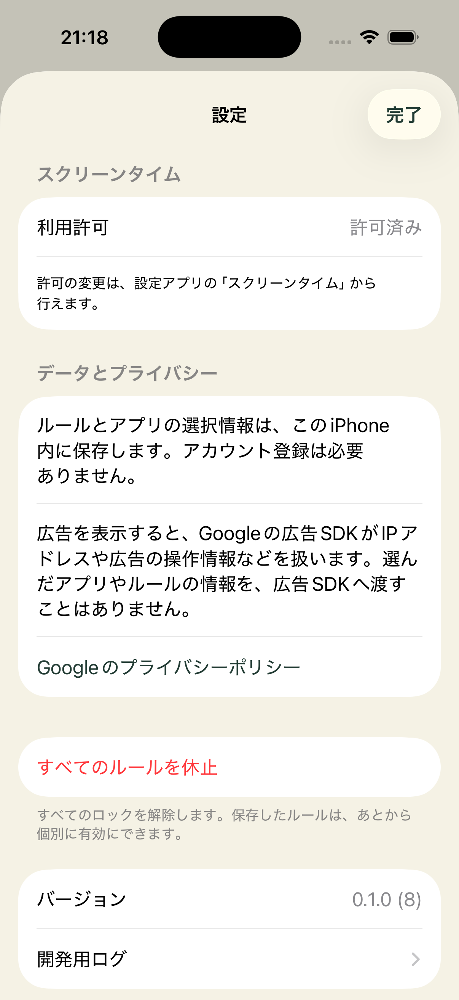

右上の歯車からシートで開きます。「完了」でホームへ戻ります。

- スクリーンタイムの利用許可を「許可済み」または「許可が必要」で表示する。未許可時は「もう一度許可する」が出る。
- ルールとアプリの選択情報は端末内保存で、アカウント登録が不要であることを説明する。
- 広告SDKが扱う情報と、ルール・選択アプリ情報を広告SDKに渡さないことを説明する。
- Googleのプライバシーポリシーを外部リンクで開く。
- 広告SDKが必要と判定した場合に「広告のプライバシー設定」を表示する。
- 「すべてのルールを休止」から確認を出し、「休止してロックを解除」で実行する。ルール自体は残り、個別に再開できる。
- バージョンを表示する。Debugビルドだけに「開発用ログ」がある。

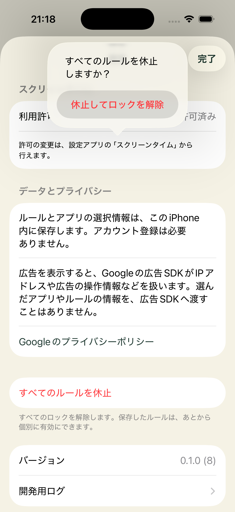

## 11. 現在の見た目

| 要素 | 現状 |
| --- | --- |
| 基本文字色・主ボタン | 濃緑、おおよそ #213B33 |
| 背景 | 薄いベージュ、おおよそ #F5F2E6 |
| 補助文字 | グレーがかった緑、おおよそ #526157 |
| アクセント | 黄緑、おおよそ #C7E08F |
| カード | 白系。ホームの通常カードは角丸22pt、大きな状況カードは28pt |
| 書体 | iOSのシステム書体。大見出しの一部はrounded、時刻は等幅数字 |
| 配置 | 1列の縦スクロール。ホーム左右20pt、解除画面左右24ptの余白 |
| 部品 | システムアイコン、スイッチ、カプセル型の曜日選択、Form、シート |
| 外観 | ライトモード固定、縦向き、日本語 |
| キャラクター | 現行画面には配置していない |

撮影環境では、ホームや解除画面の一部の濃緑ボタンで、文字が背景と同化して見えにくい状態を確認しました。画像は修正せず収録しています。説明文には実装上のボタン文言を記載しており、デザイン時には主ボタンの文字色とコントラストを確認します。

## 12. デザイン案に必要な情報

新しい案でも、現在のロック状態、ルールの有効・休止、対象アプリ、解除できる時間を読み分けられるようにします。特に、次の意味を保つ必要があります。

1. 自動ロックは曜日と時間帯によって切り替わる。
2. 広告を見るかどうかは利用者が選ぶ。途中終了と失敗では解除しない。
3. 5分解除は対象の1アプリだけで、ほかのアプリには影響しない。
4. 「ルールの時間中」「実際にロック中」「一時解除中」を区別する。
5. 保存、キャンセル、削除、一括休止で、何が残るかを伝える。
6. 権限不足、入力不備、広告準備中・失敗、0件の画面も用意する。

本体の配色、文字の強弱、カード、余白、イラスト、画面内の情報の順序は検討できます。スクリーンタイムの許可画面とアプリ選択画面はiOS標準UIです。ShieldはOSが管理する枠内での指定になり、広告画面もSDKの管理下です。

デザインを起こす主な画面は、初回ホーム、通常ホーム、ルール作成・編集、5分解除の説明、解除完了、一時解除中のホーム、設定です。小さいiPhoneの縦画面でも、主要な操作と説明が読めることを確認します。

## 13. 実装との対応

説明の基準は次の現行ソースです。元の要件書よりも、現在の画面と挙動を優先しています。

| 範囲 | ファイル |
| --- | --- |
| ホーム、カード、配色 | App/ShinobiLockApp.swift |
| ルール作成・編集、アプリ選択 | App/RuleEditorView.swift |
| 一時解除の説明、完了 | App/UnlockView.swift |
| 設定 | App/SettingsView.swift |
| 許可状態、画面データ | App/LockModel.swift |
| 広告の状態、結果表示 | App/RewardedAds.swift |
| ルール保存、50個制限、一時解除 | Shared/ProbeState.swift |
| 曜日・時間の判定、入力条件 | Core/WeeklySchedule.swift |
| 対象アプリのロック画面 | Extensions/ShieldConfiguration/ShieldConfigurationExtension.swift |
| ロック画面から本体への移動 | Extensions/ShieldAction/ShieldActionExtension.swift |

この資料はデザイン検討のための画面・機能説明です。広告配信とScreen Time連携の実機受入結果は、別資料の docs/device-verification.md と README.md に記録されています。
