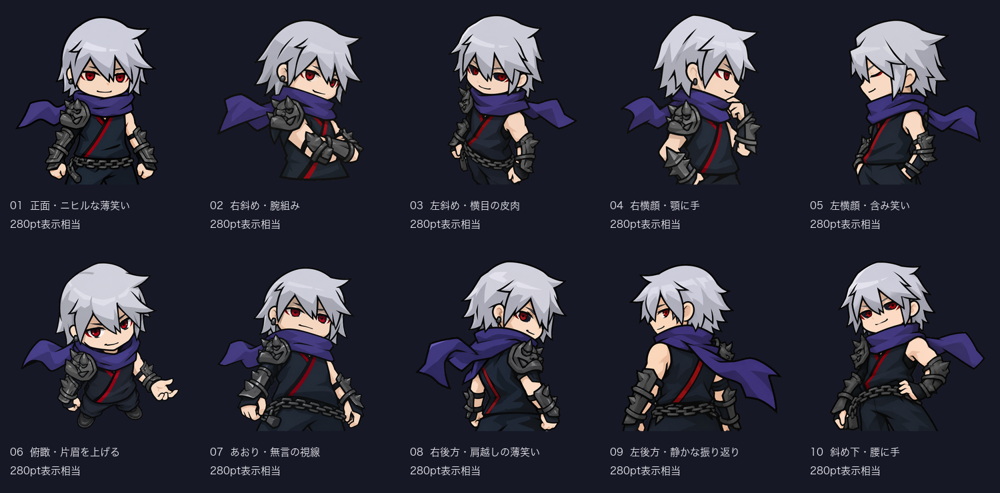
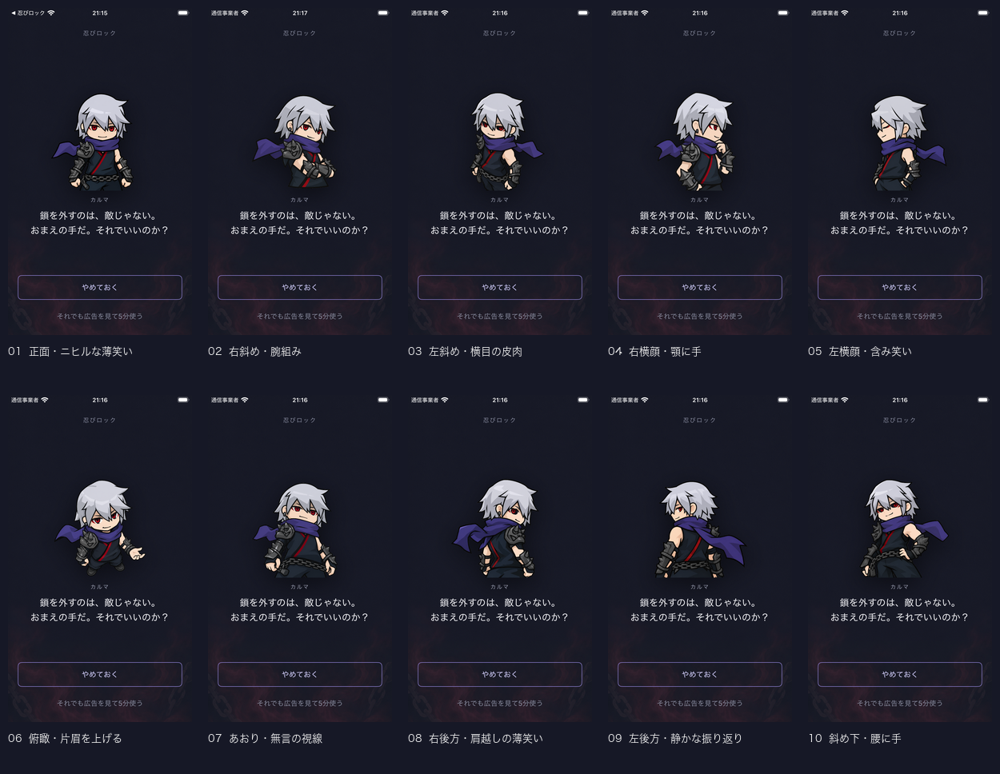

# カルマの間

「広告を見て5分使う」を押すと、広告の読み込み前にカルマの間を表示する。「やめておく」では返事を表示して解除画面を閉じ、ロックを続ける。「それでも広告を見て5分使う」で既存の広告フローへ進む。広告の再試行時にもカルマの間を通る。

VoiceOver使用中は返事を読み上げ、「ロックを続ける」で閉じる。通常は1秒後に閉じる。カルマの間ではスワイプによる閉じ操作を無効にする。

## 表情とセリフ

NINJAMCPの設定・公式2D/3D画像を参照して、クールな表情やニヒルな薄笑いを10点生成した。正面、左右の斜め・横顔、俯瞰、あおり、肩越しなどアングルを変えている。クールさと性格表現はアプリ用の創作で、プロフィールに性格の指定はない。

画像は `App/Assets.xcassets/karma-*.imageset` に格納。追加10点は1024×1024pxの透過PNGで、既存3点と合わせた13点を使用する。初回は `karma-cool-smirk`。以降は直前と同じ画像が続かないよう選び、直前の選択を端末に保存する。画像名・説明・ハッシュは [素材一覧](karma-portraits/manifest.json) に記録した。

`App/Resources/karma-lines.json` の `unlock_before_ad` は広告前のセリフ、`stayed` は踏みとどまったときの返事。文字列を編集してビルドすると反映される。セリフも直前と同じものが続かないように選ぶ。1種類だけの場合はそのセリフを表示する。

通常の画像は280pt、小さい画面では220pt。アクセシビリティの拡大文字では160ptに縮め、セリフをスクロールできるようにし、選択肢を下部に固定する。

## 確認

- Coreの23テストが成功。初回の表情、連続重複の防止、空のセリフの代替表示、JSONと13点の画像の存在を確認した。
- iOSシミュレータ向けビルドが成功。
- iPhone SE第3世代 / iOS 26.5の専用プレビューで、アプリと同じ `KarmaRoomView` に追加10点すべてを表示。輪郭の欠けや市松模様が残らないことを目視確認した。正面の絵は `accessibility3` でも画像と両方の選択肢が表示されることを確認した。
- 実機のScreen Timeと広告視聴完了後の解除は今回未確認。

